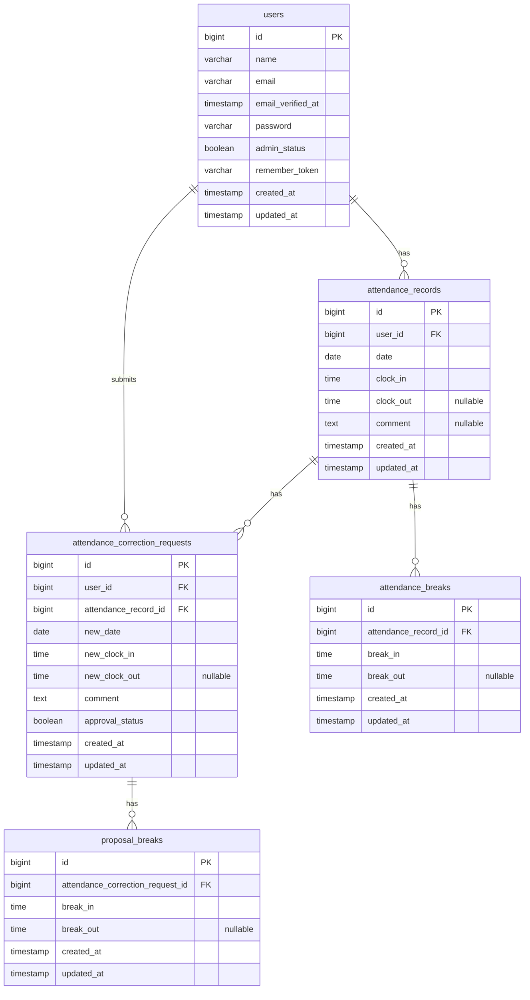

# coachtech 勤怠管理アプリ

## 概要

勤怠の登録・管理を行うための勤怠管理アプリケーションです。

## 環境構築

本プロジェクトは、Docker DesktopとLaravel Sailを使用して動作します。

### 前提条件

以下を使用できる状態にしてください。

* Git
* Docker Desktop
* WSL2（Windowsの場合）

Docker Desktopを起動してから、WSLのターミナルで以降のコマンドを実行します。

### 1. リポジトリをクローン

```bash
git clone https://github.com/akiko-11/attendance-app.git
cd attendance-app
```

### 2. Composer依存パッケージをインストール

ローカル環境でComposerを使用できる場合は、以下を実行します。

```bash
composer install
```

Composerを使用できない場合は、Dockerを利用してインストールします。

```bash
docker run --rm \
  -u "$(id -u):$(id -g)" \
  -v "$(pwd):/var/www/html" \
  -w /var/www/html \
  laravelsail/php82-composer:latest \
  composer install
```

### 3. 環境設定ファイルを作成

```bash
cp .env.example .env
```

`.env`を開き、データベース接続情報を以下のように設定します。

```env
DB_CONNECTION=mysql
DB_HOST=mysql
DB_PORT=3306
DB_DATABASE=laravel
DB_USERNAME=sail
DB_PASSWORD=password

MAIL_MAILER=smtp
MAIL_HOST=mailpit
MAIL_PORT=1025
```

### 4. Laravel Sailを起動

```bash
./vendor/bin/sail up -d
```

コンテナの状態を確認します。

```bash
./vendor/bin/sail ps
```

以下のサービスが起動していることを確認してください。

* `laravel.test`
* `mysql`
* `phpmyadmin`
* `mailpit`

### 5. アプリケーションキーを生成

```bash
./vendor/bin/sail artisan key:generate
```

### 6. マイグレーションと初期データを実行

```bash
./vendor/bin/sail artisan migrate --seed
```

既存のテーブルを削除して初期状態から作り直す場合は、以下を実行します。

```bash
./vendor/bin/sail artisan migrate:fresh --seed
```

> `migrate:fresh`を実行すると、データベース内の既存データはすべて削除されます。

### 7. フロントエンドの依存パッケージをインストール

```bash
./vendor/bin/sail npm install
```

### 8. Vite開発サーバーを起動

```bash
./vendor/bin/sail npm run dev
```

画面を確認している間は、このコマンドを実行したままにしてください。

停止する場合は、実行中のターミナルで `Ctrl + C` を押します。

### 9. アクセス（URL）

ブラウザで以下へアクセスします。

| 画面         | URL                     |
| ---------- | ----------------------- |
| アプリケーション   | `http://localhost`      |
| phpMyAdmin | `http://localhost:8080` |
| Mailpit    | `http://localhost:8025` |

### 10. Sailエイリアスを設定（任意）

毎回 `./vendor/bin/sail` と入力せず、`sail`のみで実行したい場合は以下を設定します。

bashの場合：

```bash
echo "alias sail='[ -f sail ] && bash sail || bash vendor/bin/sail'" >> ~/.bashrc
source ~/.bashrc
```

zshの場合：

```bash
echo "alias sail='[ -f sail ] && bash sail || bash vendor/bin/sail'" >> ~/.zshrc
source ~/.zshrc
```

設定後は以下のように実行できます。

```bash
sail artisan migrate --seed
sail npm run dev
```

### 11. コンテナを停止

```bash
./vendor/bin/sail down
```

### Apple Silicon搭載Macについて

Apple Silicon搭載MacでSail起動時に以下のエラーが発生する場合があります。

```text
no matching manifest for linux/arm64/v8
```

その場合は、`compose.yaml`のMySQLサービスに以下を追加します。

```yaml
platform: 'linux/amd64'
```

## 使用技術

| 技術           | バージョン・用途      |
| ------------ | ------------- |
| HTML         | 画面構造 |
| CSS          | スタイル設定 |
| PHP          | 8.5.7 |
| Laravel      | 10.50.3 |
| MySQL        | 8.4.10 |
| Vite         | 5.4.21 / フロントエンド開発環境 |
| Docker       | コンテナ環境 |
| Laravel Sail | Docker開発環境の操作 |
| phpMyAdmin   | データベース管理 |
| Mailpit      | メール送信確認 |

## ER図



### 制約

- `users.email` は一意
- `attendance_records` は `(user_id, date)` の組み合わせで一意
- `attendance_correction_requests.comment` は NULL 不可

### リレーション

- 1人のユーザーには、複数の勤怠情報および修正申請が紐づきます。
- 1件の勤怠情報には、複数の休憩情報および修正申請が紐づきます。
- 1件の修正申請には、複数の修正後休憩情報が紐づきます。

### 外部キー

- `attendance_records.user_id` → `users.id`
- `attendance_breaks.attendance_record_id` → `attendance_records.id`
- `attendance_correction_requests.user_id` → `users.id`
- `attendance_correction_requests.attendance_record_id` → `attendance_records.id`
- `proposal_breaks.attendance_correction_request_id` → `attendance_correction_requests.id`

上記の外部キーには ON DELETE CASCADE を設定しています。


## ログイン情報

| 権限 | メールアドレス | パスワード |
| --- | --- | --- |
| 一般ユーザー | user1@example.com | password |
| 一般ユーザー | user2@example.com | password |
| 管理者 | user3@example.com | password |
